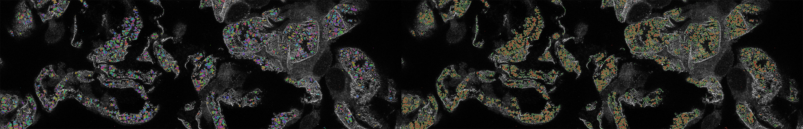

# AMAP
Automatic Morphological Analysis of Podocytes (AMAP) - method for segmentation and morphology quantification of fluorescent mocroscopy images of podocytes https://www.biorxiv.org/content/10.1101/2021.06.14.448284v3



1. Installation

Inference uses [BICO](https://ls2-www.cs.tu-dortmund.de/grav/en/bico) method to accelerate the clustering. `bico_source` contains the source code that you need to compile next copy BICO executable and CluE library to a folder `bico` next to the `amap` folder. The folder hierarchy should look as follows:

```
./amap
|---amap
|---bico
|  |---BICO_Experiments
|  |---BICO_Quickstart
|  |---cluster
|  |---libCluE.a
|---bico_source
|---sample_images
```


3. Generation of train data

Running training requires binarized image and label files that can be efficiently used through the training iterations. We provide a set of sample images and their binar labels in the `sample_images` folder. Running
```
python generate_data.py
``` 
with default arguments will convert the images in the `sample_images` folder into the binary format and place them in a `data` folder.

5. Training

Training can be performed on cpu or a given number of gpus, defined by the `-g` parameter. `-g 0` will perform the training on the cpu. For example
```
python train_amap.py -g 2
```
will use 2 gpus in training.
By default training set will be located in the `data` folder and checkpoints saved in the `checkpoints` folder according to such a folder structure:
```
./amap
|---amap
|---bico
|---bico_source
|---checkpoints
|---data
|   |---test
|---sample_images
```
with test dataset in `the data/test` folder. These parameters can be also passed as stript arguments `-dd` and `-dc` respectively.

7. Inference

The same `-g` parameter will define the device for inference. Depending on your compute capacity modify variables in the `amap_predict.py` script and adapt `NPROC_TILE` and `NPROC_CLUSTER` variables. These variables define the number of processes that will postprocess the segmentation results.

By default images are read from `sample_images` folder and results saved in `amap_res` folder. You can change these with `-i` and `-o` parameters respectively.


9. Morphometric parameters

Calling
```
python3 morphometry.py
```
will infer morphometric parameters on files in the folders set as default:
- images `-i ../sample_images`
- segmentation results `-p ../amap_res`
- output folder `-o ../amap_res/morphometry`

This script estimate individuals foot process parameters, slit diaphragm parameters, and joint results that are saved in the output folder as `all_params.xls` file. Results of each step are saved in the same folder.

